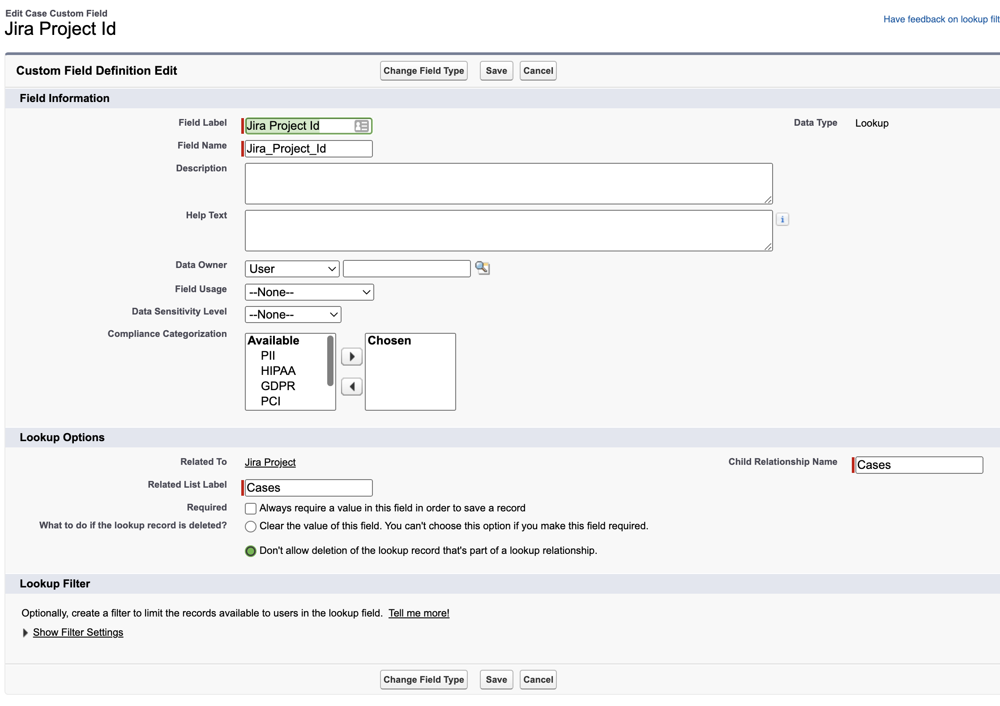

# Setup

## Objects

#### 1. Open Setup Settings

### 2. Select Object Manager Tab > create > custom object

#### Details & Fields

### 3. Select Object Manager Tab > select Case

- Select 'Fields & Relationships'
- Add the following fields

#### **_isNew_** | visibility > hidden to all

#### **_Issue Link_** | visibility > visible to all

#### **_isUpdate_** | visibility > hidden to all

#### **_Jira Issue Id_** | visibility > hidden to all

#### **_Jira Project Id_** | visibility > visible to all

### 4. Select Home Tab > Quick Find 'Tabs' > select Tabs

- Add new tab for Jira Projects

### 4. Import files from Batches, Classes, Triggers

- Open developer console and add files with their corresponding file names

- save all files and confirm no problems in the console
