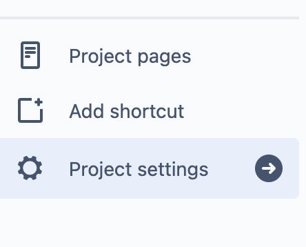
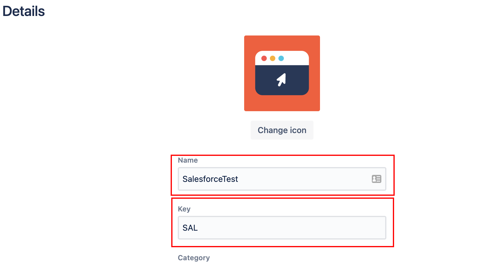
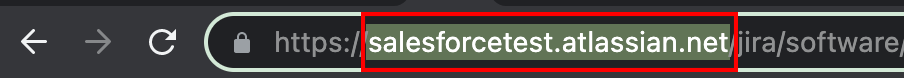
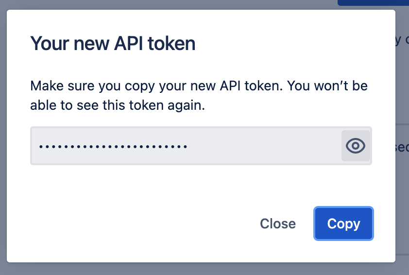
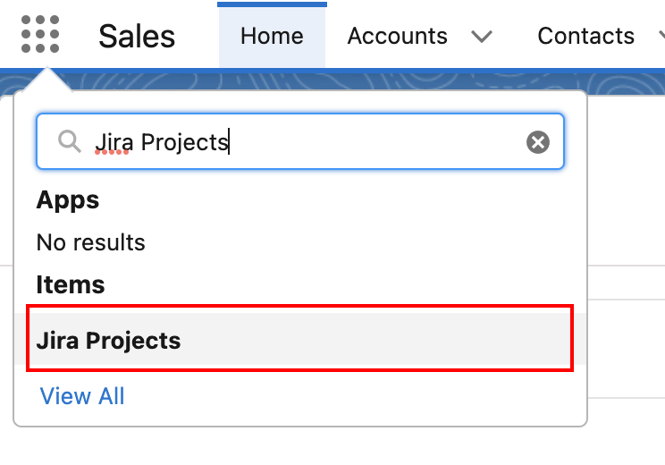
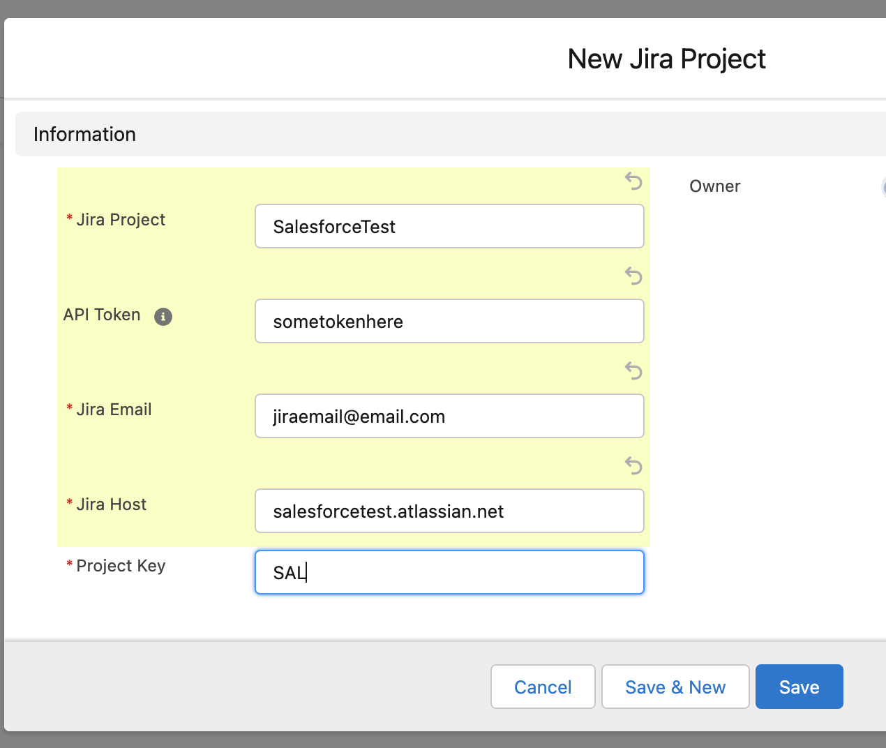
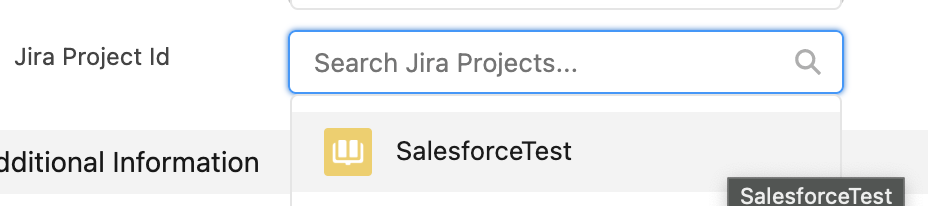

# Using Jira

## Adding Jira Account

#### 1. Login to Jira Project

1. Select Project Settings in sidebar and take note of the project Name Key and Host

- Ex:
- Name: SalesforceTest,
- Key: SAL,
- Host: salesforcetest.atlassian.net

2. Create API token in Jira

- Open Link: [https://id.atlassian.com/manage-profile/security/api-tokens](https://id.atlassian.com/manage-profile/security/api-tokens)
- select Create and Name API token and save the token in a safe place

  

  

#### 2. Login Salesforce

1. Add Jira Project to Salesforce

- Search for Jira Projects Tab in App search and select it

- Select new and add your Jira project

Ex:

- Name: SalesforceTest,
- Key: SAL,
- Host: salesforcetest.atlassian.net
- Email: Your Jira account email ie: user@email.com
- API Token: **\*\*\*\***\*\*\*\***\*\*\*\***

- Click Save
- Now your jira account is linked.

## Creating Cases

#### 1. Go to Cases and Select new

- When creating a Case, be sure to select the Jira Project you wish the Case to go to

- New case will be synced with Jira
